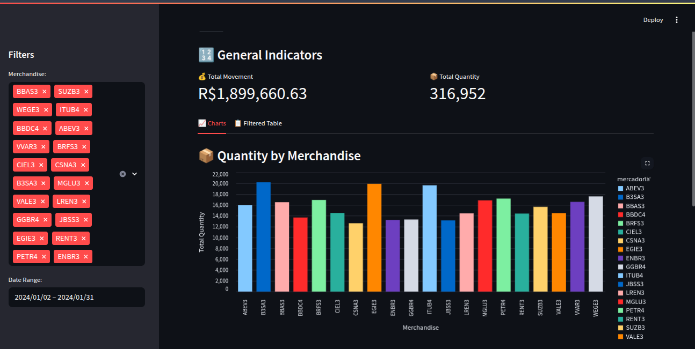

# 📈 PDF Data Extraction Pipeline

This project is a robust **ETL pipeline** and **interactive financial dashboard** built entirely in **Python**. Its main objective is to **extract and structure financial data from PDF brokerage notes** (Notas de Corretagem), load it into a **PostgreSQL database**, model it using **dbt-core**, and visualize the results through an elegant, interactive **Streamlit dashboard**.

It aims to automate and simplify the process of **tracking trades and operations in the Brazilian stock market**, providing KPIs and dynamic visualizations for informed decision-making.

---

## ⚙️ Technologies Used

- **Python** 🐍 – Core programming language for the entire project
- **Camelot** 📄 – PDF extraction tool to read and parse tabular data from brokerage notes
- **PostgreSQL** 🐘 – Relational database to store structured data
- **dbt-core** 🧪 – Data modeling and transformation framework using SQL
- **Streamlit** 📊 – For building the interactive dashboard
- **SQLAlchemy** – Database connection via Python ORM

---

## 🧠 Project Overview

1. **Extract:** Use **Camelot** to extract structured tabular data from PDF brokerage notes.
2. **Transform:** Clean and prepare the data using Python scripts, then apply advanced data modeling logic with **dbt-core**.
3. **Load:** Store the final cleaned and modeled data in a **PostgreSQL** database.
4. **Visualize:** Explore the data with a responsive **Streamlit dashboard**, including filters, KPIs, and time-based charts.

---

## 📂 Project Structure

```text
ETL-PDF-Extractor/
│
├── data/                      # Raw PDFs and exported CSVs
│
├── dashboard/                 # Streamlit app
│   └── app.py                 # Main dashboard script
│
├── dbt/                       # dbt-core project
│   ├── models/                # dbt models (SQL transformations)
│   └── dbt_project.yml        # dbt project config
│
├── etl/                       # ETL scripts
│   └── extract.py             # Camelot extraction logic
│
├── .env                       # Environment variables
├── pyproject.toml             # Poetry config and dependencies
├── README.md                  # Documentation
└── Makefile                   # Automation tasks
```

## 🚀 Getting Started

1. Clone the repository
   
```bash
git clone https://github.com/your-user/ETL-PDF-Extractor.git
cd ETL-PDF-Extractor
```

2. Install dependencies
Make sure you have Poetry installed:

```bash
poetry install
```

3. Configure environment variables
Create a .env file in the root directory with the following:

```bash
DB_HOST=localhost
DB_USER=your_user
DB_PASSWORD=your_password
DB_NAME=your_database
```

4. Run the ETL pipeline
Extract data from your PDFs:

```bash
poetry run python src/start.py
```

5. Run dbt transformations
   
```bash
cd dbt/
dbt run
```

6. Launch the dashboard with Streamlit
   
```bash
poetry run streamlit run dashboard/app.py
```

## 📘 View DBT Documentation

After building your dbt models, you can generate and access a visual documentation of your data models with:

```bash
dbt docs generate
dbt docs serve
```
This will open a browser window where you can explore your data warehouse structure, sources, models, and lineage graph

## 📊 Dashboard Features

- **Filters by commodity and date**

- **KPIs:** total quantity traded, total financial volume

- **Charts:** quantity per commodity, value over time

- **Responsive layout** with tabs for graphs and raw data

## 🖼️ Dashboard Preview

<p align="center">
  
  <br/><br/>
  
</p>


## 📌 Requirements

- Python 3.10+

- Poetry

- PostgreSQL

- System dependencies for Camelot (e.g., ghostscript, tk)

